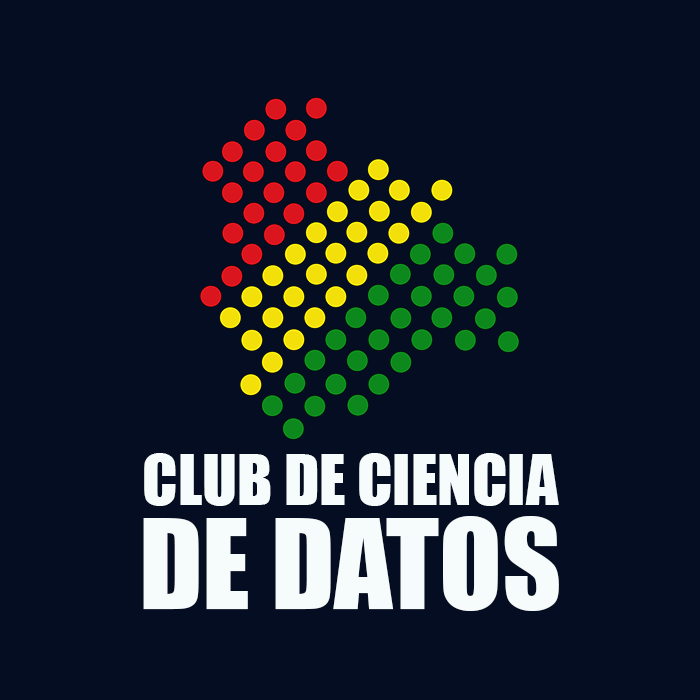

> COVID Analytics Bolivia es una iniciativa ciudadana en busca de soluciones analíticas para los distintos problemas que estamos viviendo en el país relacionados con el COVID-19. Creemos en el trabajo colaborativo y que la mejor forma de generar soluciones efectivas es a través del desarrollo e incentivo del conocimiento colectivo. 

 

> ¿En qué estamos trabajando? Revisa nuestro [__catálogo__](catalogo.html) para estar al tanto.

# Organizaciones colaboradoras

COVID Analytics Bolivia es una realidad gracias al apoyo de las siguientes organizaciones:

 

# ¡Ponte en contacto!

> ¿Te interesa colaborar o compartir ideas? No dudes en escribirnos al correo ccd.bolivia.bo@gmail.com